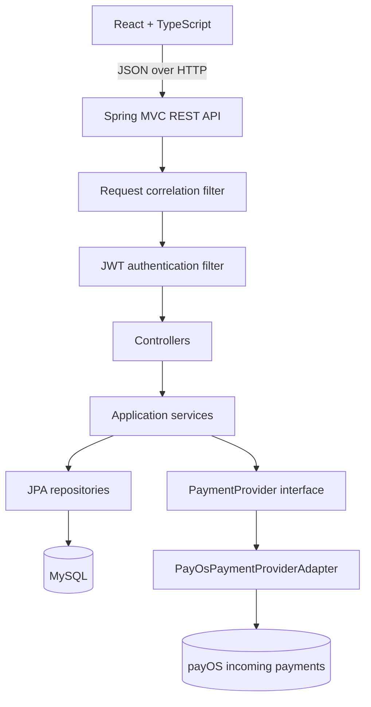

# Lumo Architecture

## Runtime Boundaries



The frontend is a client of the REST API. It does not own wallet identity, balances, authorization, or payment truth. The backend derives current-user identity from the authenticated principal and owns financial state transitions.

## Backend Layers

### Security and HTTP

`SecurityConfig` exposes authentication and webhook routes, protects normal business routes, and requires `ROLE_ADMIN` for `/api/admin/**`. `JwtAuthenticationFilter` validates tokens and reloads users so a locked account cannot continue using an old token.

`RequestCorrelationFilter` accepts a safe `X-Request-Id` or generates one, returns it in the response, places it in SLF4J MDC, and clears MDC after the request. It logs method, path, status, and duration without request or response bodies.

### Controllers

Controllers translate HTTP requests into service calls and apply request validation. Current-user operations do not accept client-supplied user IDs. Admin controllers are grouped under `/api/admin/**`.

### Services

Services contain ownership checks, limits, risk checks, idempotency, locking, payment finalization, journal posting, and transaction creation. Financial operations are transactional where the current design requires it.

### Persistence

JPA entities model users, accounts, transactions, journals, ledger accounts, ledger entries, top-ups, notifications, beneficiaries, audit records, and risk events. Repository methods provide ownership-scoped lookups and pessimistic locking where used by money operations.

## Provider Boundary

`PaymentProvider` is the application boundary for incoming payment checkout, webhook verification, and status lookup. `PayOsPaymentProviderAdapter` translates between that interface and payOS SDK/API types.

This adapter and dependency-inversion design keeps `TopUpService` independent of payOS-specific request classes. A second checkout provider would primarily require another adapter and configuration rather than a rewrite of top-up orchestration.

## Money Flows

### Add Money

```text
User -> TopUpService -> PaymentProvider -> payOS checkout
     -> provider payment -> verified webhook or status sync
     -> exactly-once finalization -> balanced journal -> wallet credit
```

The top-up is persisted as `PENDING` before the external checkout call. Frontend return URLs and query parameters are not authoritative. Wallet credit requires verified provider data matching the persisted order, amount, currency, and provider reference.

### Internal Transfer

```text
Sender wallet    -> DEBIT
Recipient wallet -> CREDIT
                   one balanced journal
```

The service locks both accounts in deterministic ID order, applies balance changes, records related transaction rows, and publishes the recipient notification according to the existing policy.

### Legacy Wallet Withdraw

`/wallet/withdraw` reduces the internal wallet and posts a counterpart to the current system-clearing ledger account. It is not connected to payOS Kênh Chi and does not send money to a bank account.

## Reliability Model

- Top-up creation supports idempotency replay and rejects incompatible reuse.
- Provider confirmation is required before top-up credit.
- Duplicate success events stop at the persisted non-`PENDING` state.
- Webhook and status-sync paths share the finalization boundary.
- Stale status, cancellation, unknown order, invalid signature, and provider failure paths do not create wallet credit.
- Existing transaction boundaries cover wallet, journal, and transaction mutation paths.

## Observability and Audit

Operational logs answer what request and internal operation occurred. Durable audit entities record administrative actions such as user lock/unlock. Application logs are not a replacement for audit history.

## Deliberately Excluded

This codebase does not contain external payout, VietQR, refund, reversal, reconciliation, deployment automation, or production browser-E2E infrastructure. These are intentional scope decisions.
