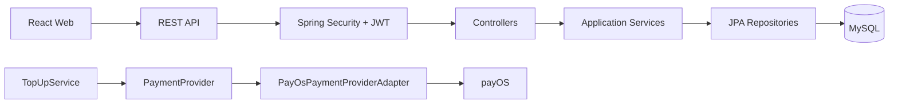

# Lumo Mini E-Wallet

Lumo is a full-stack digital-wallet and payment-ledger portfolio application. It combines a Spring Boot REST API, a React web client, MySQL persistence, JWT authentication, double-entry accounting, and payOS incoming-payment integration.

This repository demonstrates how a wallet can keep an auditable transaction history while treating an external payment provider as an untrusted, asynchronous boundary.

## What Is Implemented

- User registration with email verification codes
- JWT login and current-user access
- `USER` and `ADMIN` roles with locked-user enforcement
- Wallet balance and internal wallet transfers
- Legacy wallet deposit and withdraw operations
- Transaction history, beneficiaries, notifications, limits, and risk checks
- payOS top-up checkout, webhook verification, status synchronization, and exactly-once finalization
- Double-entry journals with debit and credit ledger entries
- Admin users, transactions, dashboard, and audit logs
- Swagger/OpenAPI documentation with JWT bearer authorization
- Request correlation IDs and safe application logging

External bank payout, payOS Kênh Chi, VietQR, refunds, reversals, reconciliation, production deployment, and production E2E are intentionally outside the project scope. `/wallet/withdraw` is legacy internal wallet functionality, not a bank payout.

## Repository Layout

```text
payment-ledger/
├── payment-ledger-service/  Spring Boot API and persistence
├── payment-ledger-web/      React + TypeScript web client
├── ARCHITECTURE.md          Application boundaries and money flows
└── DATA_MODEL.md            Entity relationships and ledger model
```

## Technology

### Backend

- Java 21
- Spring Boot 4.1.0
- Spring MVC, Spring Security, Spring Data JPA, and Hibernate
- MySQL
- Jakarta Bean Validation
- JJWT 0.12.6
- payOS Java SDK 2.0.1
- springdoc OpenAPI 3.0.2
- JUnit and Mockito

### Frontend

- React 19.1.0
- TypeScript 5.8.3
- Vite 6.0.11
- React Router 6.30.1

## Architecture



See [ARCHITECTURE.md](ARCHITECTURE.md) and [DATA_MODEL.md](DATA_MODEL.md) for the detailed design.

## Running Locally

### Prerequisites

- JDK 21
- Node.js and npm
- MySQL database

### Backend

1. Configure the backend environment variables listed below.
2. From `payment-ledger-service`, run:

```bash
./mvnw spring-boot:run
```

The API listens on `http://localhost:8080` by default.

The checked-in `application.properties` contains a development datasource template. Use a database you are authorized to access and override the datasource settings for local work. Do not commit `.env` or secret values.

### Frontend

From `payment-ledger-web`:

```bash
npm ci
npm run dev
```

The Vite development server listens on `http://localhost:5173` and proxies the configured API paths to port 8080. Set `VITE_API_BASE_URL` only when the API is hosted somewhere other than the Vite proxy.

## Environment Variables

| Variable | Purpose | Required |
| --- | --- | --- |
| `DB_PASSWORD` | MySQL password referenced by the backend datasource | Yes |
| `JWT_SECRET` | Signing secret for access tokens | Yes |
| `JWT_EXPIRATION_MS` | JWT lifetime in milliseconds | No, defaults to 3600000 |
| `MAIL_HOST` | SMTP host | No, defaults to smtp.gmail.com |
| `MAIL_PORT` | SMTP port | No, defaults to 587 |
| `MAIL_USERNAME` | SMTP username | Required for email delivery |
| `MAIL_PASSWORD` | SMTP password | Required for email delivery |
| `PAYOS_CLIENT_ID` | payOS Kênh Thu client ID | Required for top-up checkout/webhooks |
| `PAYOS_API_KEY` | payOS API key | Required for top-up checkout/status |
| `PAYOS_CHECKSUM_KEY` | payOS webhook checksum key | Required for webhook verification |
| `PAYOS_RETURN_URL` | Checkout return URL | No, defaults to `/payment-result` on localhost |
| `PAYOS_CANCEL_URL` | Checkout cancel URL | No, defaults to `/payment-result` on localhost |
| `VITE_API_BASE_URL` | Optional frontend API base URL | No |

Keep credentials in an untracked `.env` file or the process environment. Never place them in README files, source control, logs, screenshots, or frontend bundles.

## API Documentation

After the backend starts:

- Swagger UI: `http://localhost:8080/swagger-ui.html`
- OpenAPI JSON: `http://localhost:8080/v3/api-docs`

Swagger documents public authentication and webhook endpoints, authenticated wallet/user APIs, and `ADMIN`-only `/api/admin/**` APIs. Use the `Authorize` control with a locally issued JWT; no token is hardcoded in the project.

## Main API Areas

- Auth: `/auth/register/send-code`, `/auth/register`, `/auth/login`, `/auth/me`
- Wallet: `/wallet/me`, `/wallet/limits`, `/wallet/deposit`, `/wallet/withdraw`, `/wallet/transfer`
- History: `/transactions`, `/transactions/{id}`
- Beneficiaries: `/beneficiaries`
- Notifications: `/notifications`
- Top-ups: `POST /topups`, `GET /topups/{id}`, `POST /topups/{id}/sync`, `POST /topups/webhook`
- Admin: `/api/admin/users`, `/api/admin/transactions`, `/api/admin/dashboard`, `/api/admin/audit-logs`

## Security Summary

- Passwords are stored as hashes, never plaintext.
- JWTs are validated by a stateless Spring Security filter.
- `ROLE_ADMIN` is required for `/api/admin/**`; ordinary users receive `403` there.
- Missing or invalid authentication receives `401`.
- Locked users cannot authenticate with previously issued JWTs.
- User and resource ownership is resolved server-side from the authenticated principal.
- payOS webhook data is verified before financial finalization.
- Logs omit passwords, OTPs, JWTs, authorization headers, provider credentials, signatures, and full account numbers.

## Testing

Backend tests do not require real payOS, SMTP, or Aiven access:

```bash
cd payment-ledger-service
./mvnw test
```

Frontend compile/build verification:

```bash
cd payment-ledger-web
npm ci
npm run build
```

The test suite includes unit tests, MockMvc security/integration tests, ledger invariants, top-up provider reliability tests, and guarded database tests. Database integration tests require explicit local test-database variables and are otherwise skipped.

## Portfolio Highlights

- Provider abstraction keeps `TopUpService` independent of payOS SDK models.
- Financial history is represented by transactions plus balanced journals, not only a mutable balance column.
- Pessimistic account locking and deterministic lock ordering protect transfer operations.
- Idempotency and status guards make repeated asynchronous payment events safe.
- Durable audit logs are kept separate from operational application logs.
- Swagger and request correlation improve operability without adding a tracing platform.

## Limitations and Scope Decisions

- The application is a portfolio project, not a production deployment blueprint.
- The default persistence configuration expects MySQL and must be configured for the local environment.
- No real-money bank payout flow exists.
- No refund, reversal, reconciliation engine, deployment automation, or browser E2E suite is included.
- Provider, email, database, and frontend behavior still requires environment-specific integration verification before production use.

## Smoke-Test Checklist

- [ ] Configure a local MySQL database and required environment variables.
- [ ] Start the backend and confirm `GET /health` returns `UP`.
- [ ] Start the frontend and open `http://localhost:5173`.
- [ ] Register, receive a verification code, and log in.
- [ ] Confirm an authenticated wallet request succeeds and an unauthenticated request returns `401`.
- [ ] Exercise a transfer and confirm sender/recipient balances and activity history.
- [ ] If payOS credentials are intentionally configured, test top-up checkout and verify the return/status flow.
- [ ] Verify Swagger UI loads and protected operations show JWT authorization.
- [ ] Confirm response headers include `X-Request-Id`.
- [ ] Run backend tests and the frontend build.
